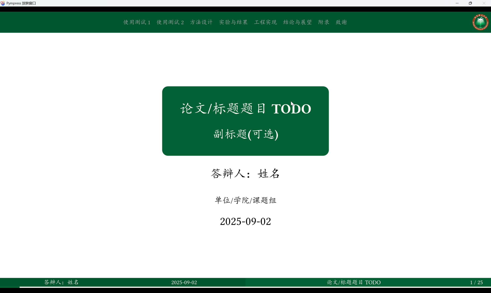

使用Typst的touying 包制作一个北理工风格的PPT模版

基于自带stargazer模版魔改

主要修改配置颜色

```typst
config-colors(
        //标题和footer-c/d的颜色
        primary: rgb("#00773E"),
        // footer-a/b的颜色
        neutral-darkest: rgb("#00562E"),
   ),
```

参考[BITthesis的演示文档风格](https://bithesis.bitnp.net/guide/preface.html])

效果展示



后续计划

- [ ] ctez绘图演示
- [ ] 公式推导示例
